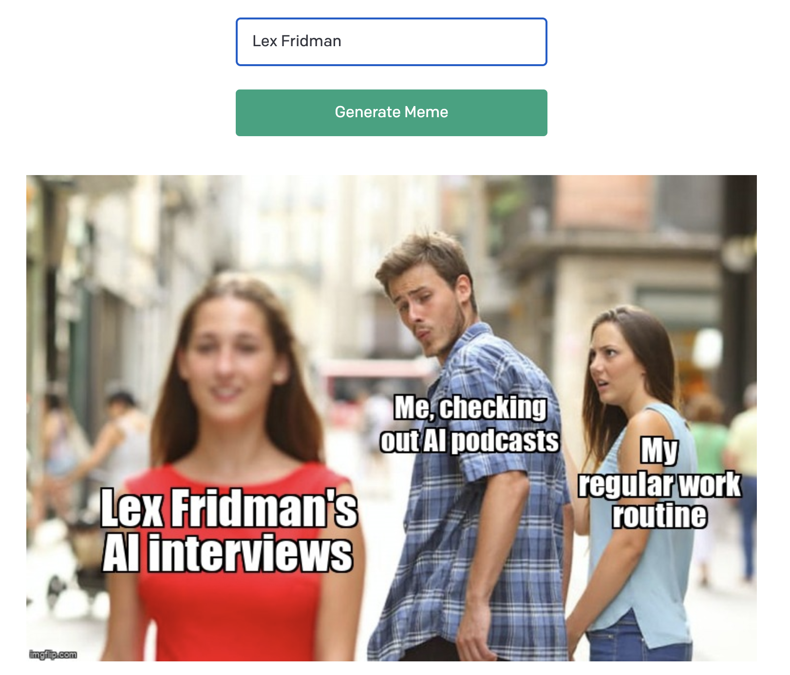

# Distracted Boyfriend AI Meme Generator

[](https://youtu.be/eYwDiV8hhB8)

This Python project generates your own Distracted Boyfriend meme.

You type in a topic of interest and LangChain and OpenAI generate the text for the meme. We pass this on to Imgflip to generate the actual meme.

With [LangChain](https://github.com/hwchase17/langchain) we:

1. Describe the Distracted Boyfriend meme
2. Generate text based on a topic you input
3. Leverage LangChains `ResponseSchema`, `StructuredOutputParser` and `ChatPromptTemplate` to return a determinate JSON response
4. Grab the text from the response and send that off to Imgflip to generate the meme

This app runs locally on your machine with Flask. 

This project was started with the [OpenAI python quickstart repo](https://github.com/openai/openai-quickstart-python).

## Demo

A demo using Lex Fridman: https://lexfridman.com/. Sorry Lex next time I will spell your last name correctly!

Goes to show that GPT-4 still knew who I was talking about.

Video: https://youtu.be/eYwDiV8hhB8

## Prerequisites

Before you begin, ensure you have met the following requirements:

- Installed a recent version of Python (3.7 or newer) installed and a way to create virtual environments (virtualenv or conda)
- Created OpenAI API account and obtain an OpenAI API key
- Created a Imgflip account and save your username and password

## Getting Started

Clone the repo

```bash
git clone https://github.com/waseemhnyc/Distracted-Boyfriend-AI-Meme-Generator
```

Create a virutalenv and source the environment

```bash
python3 -m venv myenv
source venv/bin/activate
```

Install the necessary libraries

```bash
pip install -r requirements.txt
```

Create a .env file and input your OpenAI API Key and Imgflip credentials in the file

```bash
cp .env.example .env
```

## Usage

To run the program, run the following command in the terminal:

```bash
flask run
```

## Questions or Get in Touch

- Twitter: https://twitter.com/waseemhnyc
- Email: waseemh.nyc@gmail.com

## License

This project is licensed under the MIT License - see the LICENSE file for details.
